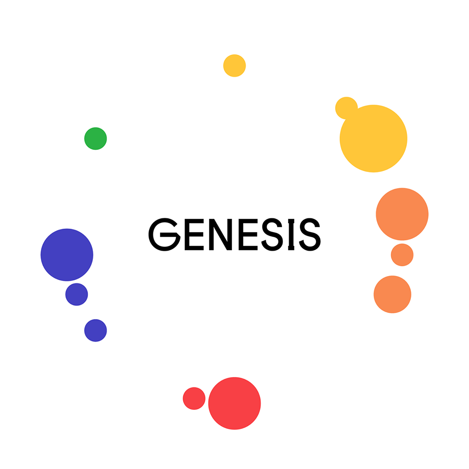

<!-- Research -->
<h1 class="section-title">Research</h1>

    

    <h3>​ Text Classification with Deep Learning </h3>
    
December 2017 - June 2018 

    
Abstract: Nowadays, retail e-commerce sales are quickly increasing. Large online e-commerce websites serve millions of users’ requests per day. Therefore it is necessary to make the processes of registrations and purchases as much convenient and fast as possible. Therefore, the problem of advertisement automatic category prediction is very important in terms of saving moderators’ time and as a result, decreasing the number of necessary moderators to process them. Effective algorithms which would work with text data, have high accuracy and appropriate speed are in high Demand.

    
<b>The objective</b> of this thesis was to build an effective model which would have high accuracy and appropriate speed for classification of advertisements at the ecommerce platform <a href="https://jiji.ng/">Jiji.ng.</a> 
    In particular:
        <ul>
            <li> consider different models that are used for texts classification </li>
            <li> compare performance of Deep Learning arhitectures </li>
            <li> compare efficiency of CNNs vs RNNs for NLP related tasks </li>
        </ul>
    

    
 Mentors: Anton Maltsev

    <a href="https://github.com/tankz0r/Bachelor_thesis/blob/master/Thesis/thesis.pdf" class="btn btn-light">
        <i class="fa fa-file"></i> Paper
    </a>
    <a href="https://github.com/tankz0r/Bachelor_thesis/blob/master/Presentation/presentation.pdf" class="btn btn-light">
        <i class="fa fa-file"></i> Presentation
    </a>

<!-- Experience -->
<h1 class="section-title">Work Experience</h1>

    

    <h3>Data Scientist <a href="https://mergerspot.de/" class="btn btn-light"> Mergerspot </a></h3>
    
August 2019 - Present

Mergerspot provides a market research software and tools for an evaluation on company level by visualizing key investment criteria. Additionally, they enable analysts to understand market dynamics including competitors, trends within the market.
    
 Main responsibilities:
        <ul>
        <li>Broadened knowledge of HTTP standards, API best practices, REST, web security and authentication</li>
        <li>Taught myself Cloud Computing, Kubernetes, Terraform and automated deployment and management of containerized microservices(decreased month price for GCP ~5 times)</li>
        <li>Continuous Integration with GitLab</li>
        <li>Integrated monitoring system for ML models</li>
        <b>Technologies</b>:​​ Terraform, K&S, Docker; RabbitMQ, Consul.
        </ul>
    

    

    <h3>Full Stack Developer <a href="https://tum.de/" class="btn btn-light"> TUM </a></h3>
    
April 2019 - August 2019

WISDOM - a project which was launched in 2018 as a cooperation between Technical University of Munich and Publishing Group “Holtzbrinck” - a metadata platform for visualizing and analyzing data of scientific publication. Where out of unstructured information in single articles, structured facts are extracted. However, for this, domain experts are necessary to extract this information. While this ensures high quality, it is very cost-intensive and time-consuming. It is not scalable. Therefore, manual extraction should be substituted by supervised automated supervision. Project WISDOM is an interactive machine learning system that automates this process. 
    
 Main responsibilities:
        <ul>
      <li>Participated in design implementation and support of ML end-to-end pipeline which retrains
model, reweight parameters and provides a feedback loop.</li>
      <li>Built a full-stack web app and launched it. Developed backend and frontend.</li>
      <li>Developed backend and frontend. Worked with Flask back-end web application framework.</li> 
      <li>Improved an Automatic Information Extraction using Dependency Parsers from the scientific papers (~10% growth).</li>
        <b>Technologies</b>:​​ spaCy, NLTK, StanfordNLP; Flask, Vue.js; MongoDB.
        </ul>
    

     <a href="https://drive.google.com/file/d/1pjNF23L06DOhLyrhXl_eAR-LtB7kaOcC/view?usp=sharing" class="btn btn-light">
        <i class="fa fa-file"></i> Presentation
    </a>

    

    <h3>Junior Machine Learning Engineer <a href="https://gen.tech/" class="btn btn-light"> Genesis Tech</a></h3>
    
June 2017 - August 2018

    I worked in a project Jiji.ng - Nigeria's number one online marketplace that enables users post free ads and get buyers faster. Jiji was founded in 2014 and within a short space of time it has grown to become the market leader in Nigeria. 
    
 Main responsibilities:
        <ul>
        <li>Website User Text Analysis: error detection and correction of the English texts, gibberish detection, semantic analysis using NLP based approaches </li>
        <li>Improvement of advert auto-moderation system (10% growth): implemented models for multi-class classification of pictures and texts using Deep Learning Neural Networks. </li>
        <li>Development of recommendation system </li>
        <li>Improvement of fraud detection(~15% improvement)</li>
        <b>Technologies</b>:​​ Python; Keras, TensorFlow, PySpark, NLTK, gensim, spaCy, AllenNLP; Flask, SQLAlchemy, Celery; Clickhouse, Elasticsearch, PostgreSQL; Git, Jira.
        </ul>
    

<!-- Projects -->
<h1 class="section-title">Projects</h1>

    

    <h3>Human pulse measurement with web camera</h3>
    
April 2015

    

        <i class="fa fa-star"></i>
        University project
    

    
Our pulse is the rate at which heart beats. As our heart pumps blood through the body, we can feel pulsing in some of the blood vessels close to the skin`s surface, such as in our head, neck or upper arm. To the human eye, no matter how long and hard you stare at your wrist or someone else’s face, you would struggle to detect a change in color. For a computer, however, the tiniest per-pixel fluctuations are easy to detect. As our heart pumps blood around body arteries swell with bright red blood, which changes the color of skin slightly. Thus we can measure accurately our heart rate. This project works by combining several techniques common in the field of computer vision.

    <a href="https://github.com/tankz0r/KPI-2016-Human-pulse-measurement" class="btn btn-light">
        <i class="fab fa-github"></i> GitHub
    </a>

